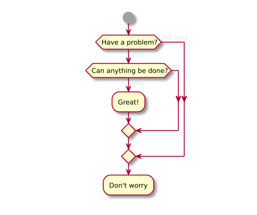

# PlantUML
## text ⌲ diagrams

---
## UML
@ul
* U
* M
* L
@ulend

+++
### U
* Unified

+++
### M
* Unified
* Modelling

+++
### L
* Unified
* Modelling
* Language

---
## Agenda
* What?
* Why?
* How?

+++
## What?
* Type in plain text:
  * Processes / sequences
  * Objects / data structures
  * Packages / architecture
  * Flow charts
  * Gantt charts
  * GUI / form sketches
  * Maths

+++
## What more?
* [PlantUML](http://plantuml.com/) draws and lays-out elements

* Exports in many image formats
  * SVG
  * PNG

+++
## Why?
* Visualise & share ideas
* Don't worry about lining-up elements
* Easy to read & update
* Source control, alongside code
* Rough & ready - for internal use

+++
## How?
* [Language Reference Guide](http://plantuml.com/PlantUML_Language_Reference_Guide.pdf)
  * PDF user manual - includes many examples
* [PlantText.com](https://www.planttext.com/)
  * Online edit & preview - with samples
* [VS Code extension](https://marketplace.visualstudio.com/items?itemName=jebbs.plantuml)
  * Syntax help, preview, export
* [Chrome extension](https://chrome.google.com/webstore/detail/plantuml-viewer/legbfeljfbjgfifnkmpoajgpgejojooj)
  * View (local) diagrams in the browser
    * "Allow access to file URLs" in [extension settings](chrome://extensions/?id=legbfeljfbjgfifnkmpoajgpgejojooj)
* [GoogleDocs extension - PlantUML Gizmo](https://chrome.google.com/webstore/detail/plantuml-gizmo/gkhhgpmifdpiagjagcbconfnnhkmomnp)

---
## Alternatives
* [Draw.IO](https://www.draw.io/)
  * Confluence integration
  * Example: [Realtime bus - subscription creation](https://publictransportvic.atlassian.net/wiki/spaces/BP/pages/586022999/Creating+Subscriptions)
* [UMLet](https://www.umlet.com/)
* [ZenUML](https://app.zenuml.com/)
  * Fast & sleek sequence diagrams in the browser.